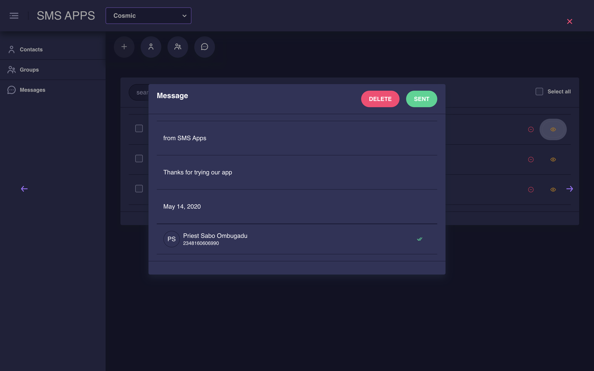
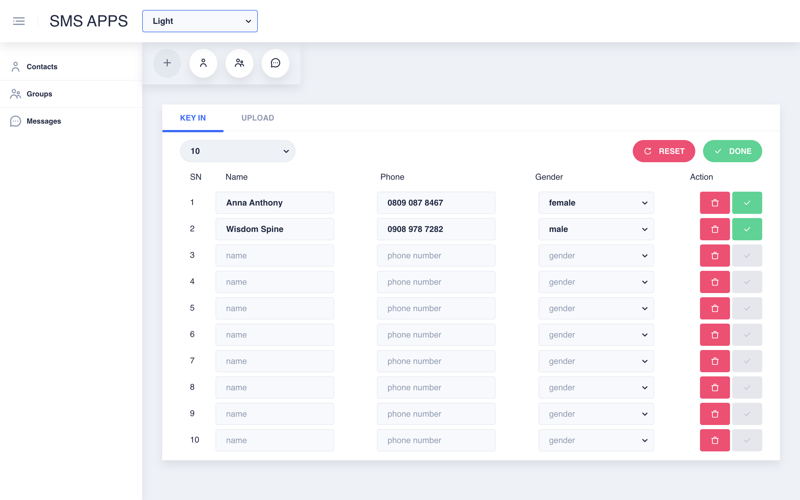
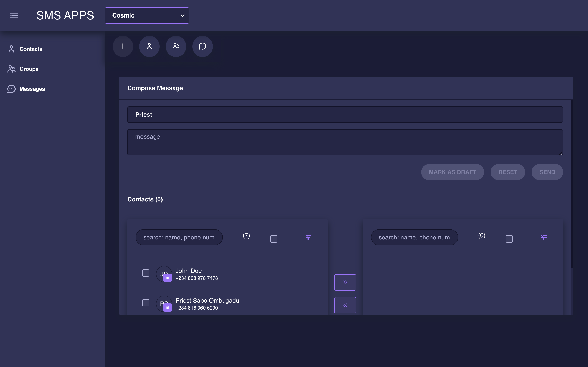

# SMS

**[SMS](https://sms-app-8ea41.web.app)** is an application for sending bulk marketing SMS to contacts list (optionally grouped into categories). You can add a contact to the application individually or perform a bulk import from an excel app. It was built with Angular, Nebular UI, Firebase, HTML, CSS, and Electron.
You can give the web version a try at **[SMS](https://sms-app-8ea41.web.app)**

## Setting up

Clone the project to your computer and run `npm install` **Ensure that NodeJs and npm are installed on your computer**

## Development server

Run `ng serve` for a dev server. Navigate to `http://localhost:4200/`. The app will automatically reload if you change any of the source files.

## Build

Run `ng build` to build the project. The build artifacts will be stored in the `dist/` directory. Use the `--prod` flag for a production build.

## Snapshots of the app in action

